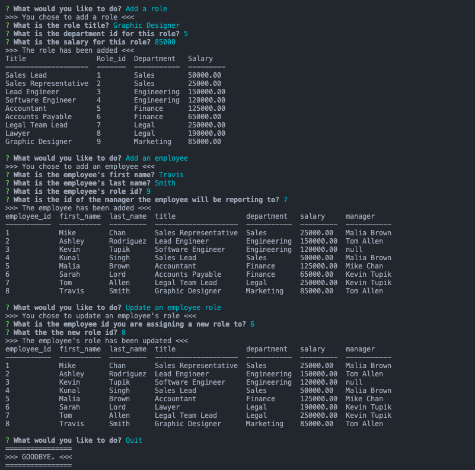

# Employee Tracker
<a href="#license"></img></a>

## Description
A command-line application, built from scratch, to manage a company's employee database, using Node.js, Inquirer, and MySQL.

### User Story
AS A business owner
I WANT to be able to view and manage the departments, roles, and employees in my company
SO THAT I can organize and plan my business

## Table of Contents
- <a href="#acceptance-criteria">Acceptance Criteria</a>
- <a href="#installation">Installation</a>
- <a href="#usage">Usage</a>
- <a href="#mock-up">Mock-Up</a>
- <a href="#deployed-application">Deployed Application</a>
- <a href="contributors">Contributors</a>
- <a href="#license">License</a>

## Acceptance Criteria
GIVEN a command-line application that accepts user input

WHEN I start the application
THEN I am presented with the following options: view all departments, view all roles, view all employees, add a department, add a role, add an employee, and update an employee role

WHEN I choose to view all departments
THEN I am presented with a formatted table showing department names and department ids

WHEN I choose to view all roles
THEN I am presented with the job title, role id, the department that role belongs to, and the salary for that role

WHEN I choose to view all employees
THEN I am presented with a formatted table showing employee data, including employee ids, first names, last names, job titles, departments, salaries, and managers that the employees report to

WHEN I choose to add a department
THEN I am prompted to enter the name of the department and that department is added to the database

WHEN I choose to add a role
THEN I am prompted to enter the name, salary, and department for the role and that role is added to the database

WHEN I choose to add an employee
THEN I am prompted to enter the employee’s first name, last name, role, and manager, and that employee is added to the database

WHEN I choose to update an employee role
THEN I am prompted to select an employee to update and their new role and this information is updated in the database

## Installation
- Clone the directly from the GitHub repository to your local machine.
- Run _npm init_ in the command line.
- Run the command _node app.js_ to launch the application.

## Usage
To eaily see company and employee structure and make changes.

## Mock-Up

## Deployed Application
Live url: n/a
Repo url: https://github.com/cpm-128/employee-tracker

### Screencapture

### Video Walkthrough
<a href="https://drive.google.com/file/d/11XcfbfJ1694hg6FKGiZGUbNXT_4iEfTG/view">Watch here.</a>

## Contributors
n/a

## License
MIT License

Copyright (c) [2022] [Colleen Maher]

Permission is hereby granted, free of charge, to any person obtaining a copy
of this software and associated documentation files (the "Software"), to deal
in the Software without restriction, including without limitation the rights
to use, copy, modify, merge, publish, distribute, sublicense, and/or sell
copies of the Software, and to permit persons to whom the Software is
furnished to do so, subject to the following conditions:

The above copyright notice and this permission notice shall be included in all
copies or substantial portions of the Software.

THE SOFTWARE IS PROVIDED "AS IS", WITHOUT WARRANTY OF ANY KIND, EXPRESS OR
IMPLIED, INCLUDING BUT NOT LIMITED TO THE WARRANTIES OF MERCHANTABILITY,
FITNESS FOR A PARTICULAR PURPOSE AND NONINFRINGEMENT. IN NO EVENT SHALL THE
AUTHORS OR COPYRIGHT HOLDERS BE LIABLE FOR ANY CLAIM, DAMAGES OR OTHER
LIABILITY, WHETHER IN AN ACTION OF CONTRACT, TORT OR OTHERWISE, ARISING FROM,
OUT OF OR IN CONNECTION WITH THE SOFTWARE OR THE USE OR OTHER DEALINGS IN THE
SOFTWARE.